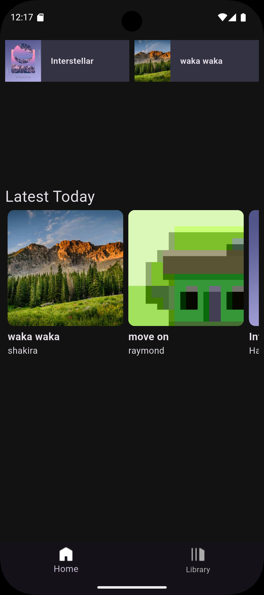
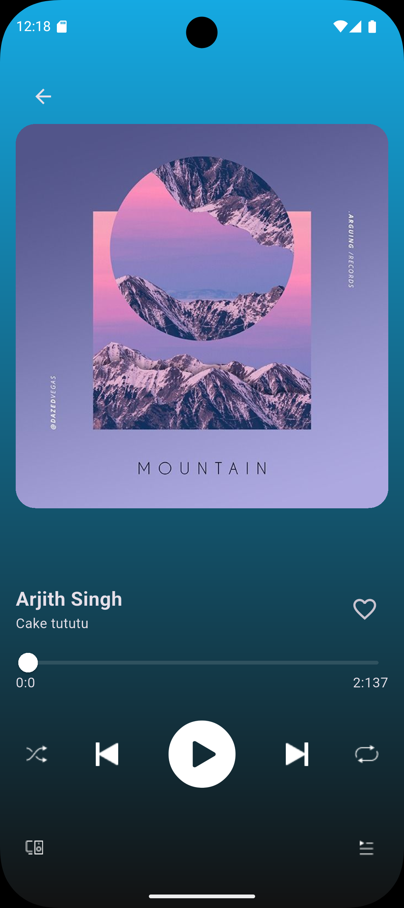
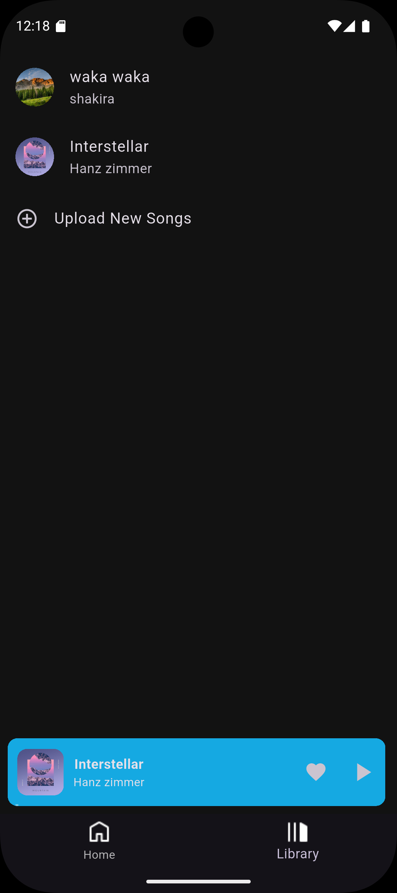

# Spotify Clone 🎵

A **full-stack music streaming application** inspired by Spotify, built with **FastAPI**, **PostgreSQL**, and **Flutter (MVVM + Riverpod)**. Play songs in the foreground while exploring playlists, favorites, and more.

---

## Demo


[Watch the Full Demo Video](https://www.youtube.com/shorts/4h58Qp_6Sac)

---

## Features

- **User Authentication**: Sign up, login, and manage profiles.  
- **Music Streaming**: Play songs with **foreground audio support**.  
- **Favorites & Playlists**: Save favorite tracks and create custom playlists.  
- **Search & Browse**: Explore songs, albums, and artists.  
- **Recent Songs Storage**:  
  - Uses **Shared Preferences** and **Hive** to locally store recently played songs for quick access.  
- **Full-stack Architecture**:  
  - **Backend**: FastAPI with PostgreSQL.  
  - **Frontend**: Flutter with **MVVM architecture** and **Riverpod** for reactive state management.

---

## Screenshots

### Home Screen


### Now Playing


### Favorites & Playlists



---

## Tech Stack

- **Backend**: FastAPI, PostgreSQL, SQLAlchemy  
- **Frontend**: Flutter, MVVM + Riverpod  
- **Audio**: Just Audio for foreground music playback  
- **Local Storage**: Shared Preferences & Hive  

---


1. **Clone the repository**:  
```bash
git clone <repo-url>
cd spotify-clone/backend
